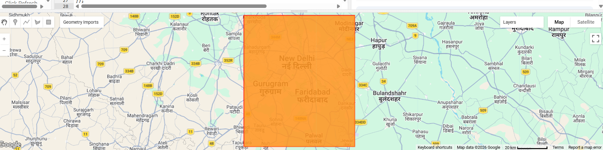
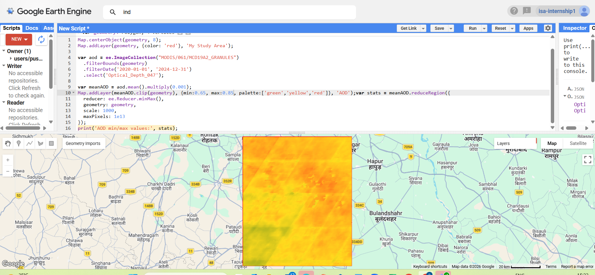
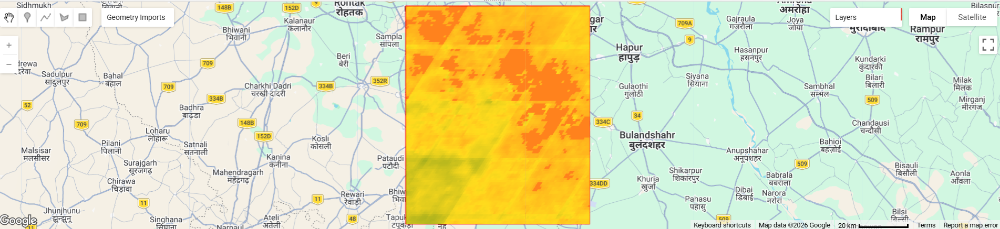

# 🛰️ Air Quality & Aerosol Pattern Mapping — Delhi NCR

Spatio-temporal analysis of Aerosol Optical Depth (AOD) over the Delhi National Capital Region using MODIS satellite imagery and Google Earth Engine, to identify pollution hotspots and classify air quality zones.


---

## 📍 Overview

| | |
|---|---|
| **Study Area** | Delhi NCR (New Delhi, Gurugram, Faridabad) |
| **Data Source** | MODIS Aerosol Optical Depth (AOD) — `MODIS/061/MCD19A2_GRANULES` |
| **Time Period** | January 2020 – December 2024 |
| **Platform** | Google Earth Engine (JavaScript API) |
| **Resolution** | 1000 m |
| **Type** | Internship Project — India Space Academy, Summer Training Program 2026 |

## 🎯 Objective

To analyze the spatial and temporal distribution of aerosol concentration over Delhi NCR using satellite data, and to identify pollution hotspots and patterns linked to urbanization and traffic activity.

## 🗺️ Study Area

<p align="center">
  
</p>

AOI manually drawn over the Delhi NCR region (New Delhi, Gurugram, Faridabad) using the GEE drawing tool.

## ⚙️ Methodology

1. Defined Area of Interest (AOI) via GEE drawing tools
2. Loaded MODIS AOD image collection, filtered by bounds and date range
3. Scaled raw values (`× 0.001`) to obtain true AOD
4. Computed mean AOD composite across the study period
5. Applied threshold-based classification into Low / Moderate / High pollution zones
6. Generated pollution hotspot mask (AOD > 0.8)
7. Computed per-class area statistics using `pixelArea()` + grouped reduction

### Code

```javascript
var aoi = ee.FeatureCollection("users/yourusername/your_AOI");
Map.centerObject(aoi, 8);

var aod = ee.ImageCollection("MODIS/061/MCD19A2_GRANULES")
  .filterBounds(aoi)
  .filterDate('2020-01-01', '2024-12-31')
  .select('Optical_Depth_047');

var meanAOD = aod.mean().multiply(0.001);
Map.addLayer(meanAOD.clip(aoi), {min:0.65, max:0.85, palette:['green','yellow','red']}, 'AOD');

var hotspot = meanAOD.gt(0.8);
Map.addLayer(hotspot.updateMask(hotspot).clip(aoi), {palette:['red']}, 'Pollution Hotspots');

var classified = meanAOD.gt(0.8).add(meanAOD.gt(0.7)).add(meanAOD.gte(0));

var areaImage = ee.Image.pixelArea().divide(1e6).addBands(classified);
var areaStats = areaImage.reduceRegion({
  reducer: ee.Reducer.sum().group({groupField: 1, groupName: 'class'}),
  geometry: aoi,
  scale: 1000,
  maxPixels: 1e13
});
print('Area per pollution class (sq km):', areaStats);
```

## 📊 Results

<p align="center">
  
</p>

<p align="center">
  
</p>

| Class | Area (sq. km) | % of Total |
|---|---:|---:|
| 🟢 Low pollution | 239.79 | 3.6% |
| 🟡 Moderate pollution | 5,332.03 | 80.0% |
| 🔴 High pollution | 1,094.24 | 16.4% |
| **Total** | **6,666.06** | **100%** |

## 🔎 Key Findings

- ~80% of the Delhi NCR study area falls under **Moderate pollution**, with a significant 16.4% classified as **High pollution**
- High-AOD zones cluster in the central and eastern sectors, consistent with dense urban and traffic activity
- Only 3.6% of the area shows Low pollution, corresponding to lower-density peripheral zones
- Results align with existing literature (Sharma et al., 2021) identifying Delhi NCR as one of India's most consistently polluted urban regions when assessed via MODIS AOD

## ⚠️ Limitations

- AOD is a **columnar** atmospheric measurement, not ground-level pollutant concentration — cross-validation with CPCB ground stations would strengthen health-impact conclusions
- Classification thresholds were empirically set based on observed min/max values for this region and time period

## 📚 References

1. Sharma, V., Ghosh, S., Bilal, M., Dey, S., & Singh, S. (2021). Performance of MODIS C6.1 Dark Target and Deep Blue aerosol products in Delhi National Capital Region, India. *Atmospheric Pollution Research*, 12(3), 65–74.
2. Kumar, P., et al. (2024). Aerosol-PM2.5 Dynamics: In-situ and satellite observations under the influence of regional crop residue burning in post-monsoon over Delhi-NCR, India.
3. [Google Earth Engine Data Catalog — MODIS/061/MCD19A2_GRANULES](https://developers.google.com/earth-engine/datasets/catalog/MODIS_061_MCD19A2_GRANULES)

## 🛠️ Tech Stack

`Google Earth Engine` · `JavaScript` · `MODIS Satellite Data` · `Remote Sensing` · `GIS`

---

**Internship:** Summer Training Program 2026, India Space Academy — Department of Space Education
**Supervisor:** Miss. Alisha Sinha
**Author:** Pushkar Tyagi, Shivaji College, University of Delhi
